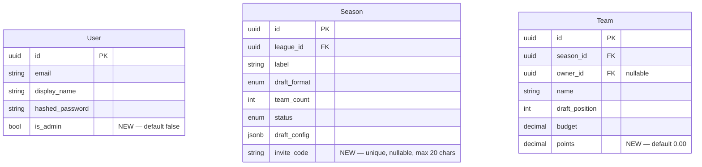

# Phase 1 — Auth, Invite Code & Join Flow Foundation

## Overview

This plan implements the foundation for the multi-user IPL Fantasy Draft experience: user roles (`is_admin`), season invite codes, the join-by-code flow, "My Leagues" view, and the admin create league/season flow. Without this, every user sees the same static interface with no identity or ownership.

This is a prerequisite for everything in [brainstorm/2026-03-11-season-admin-rules-brainstorm.md](../brainstorm/2026-03-11-season-admin-rules-brainstorm.md) (Phase 2).

---

## Problem Statement

The current app has no multi-user identity layer:
- All users see the same navbar (Home + Login only)
- The season creation form lives on `page-league.ts`, visible to everyone
- There is no way for users to "join" a season — all teams were auto-created empty
- `GET /api/auth/me` does not expose `is_admin`
- No "My Leagues" view exists — users have no persistent entry point to their seasons
- The admin has no dedicated create flow with invite code display

---

## Proposed Solution

Per the locked decisions in [brainstorm/frontend-ux-flow.md](../brainstorm/frontend-ux-flow.md):

- Add `is_admin` to User, `invite_code` to Season, `points` to Team
- Generate `invite_code` on season creation; remove auto-team creation
- Add `POST /seasons/join`, `GET /seasons/mine`, `GET /leagues/mine` endpoints
- Update frontend auth service with cached `getMe()` and `isAdmin()`
- Refactor navbar to be role-aware
- Add new pages: `/join`, `/my-leagues`, `/admin/create`
- Refactor `page-home` and `page-league` for the new UX

---

## Technical Approach

### Data Model Changes



### Key Architectural Decisions

| Decision | Rationale |
|---|---|
| `invite_code` on Season (not League) | Admins share per-season codes; multiple seasons can exist per league |
| `is_admin` is app-wide bool | Simpler than per-league roles for now; full RBAC is future work |
| User info cached in-memory module variable | Simpler than localStorage; cleared on logout; survives component re-mounts |
| `GET /api/leagues/mine` as new route (not replacing existing) | Avoids breaking commissioner-only `GET /api/leagues` used elsewhere |
| Team created on `POST /seasons/join` | Users own their team from creation; draft_position is temporary, randomized before draft |

---

## Implementation Phases

### Phase 1A: Backend — Models + Migration

**Files to modify:**

**`backend/app/models/user.py`**
```python
from sqlalchemy import Boolean, String  # add Boolean to imports
# Add field:
is_admin: Mapped[bool] = mapped_column(Boolean, default=False, nullable=False)
```

**`backend/app/models/season.py`**
```python
from sqlalchemy import ..., String  # String already imported
# Add field:
invite_code: Mapped[str | None] = mapped_column(String(20), unique=True, nullable=True, index=True)
```

**`backend/app/models/team.py`**
```python
from decimal import Decimal
from sqlalchemy import Numeric
# Add field:
points: Mapped[Decimal] = mapped_column(Numeric(10, 2), default=Decimal("0"), nullable=False)
```

**`backend/migrations/versions/<new_hash>_phase1_fields.py`** (generate via alembic)
```
alembic revision --autogenerate -m "phase1_fields"
```
Expected operations:
- `op.add_column('users', sa.Column('is_admin', sa.Boolean(), nullable=False, server_default='false'))`
- `op.add_column('seasons', sa.Column('invite_code', sa.String(20), nullable=True))`
- `op.create_index('ix_seasons_invite_code', 'seasons', ['invite_code'], unique=True)`
- `op.add_column('teams', sa.Column('points', sa.Numeric(10, 2), nullable=False, server_default='0'))`

> ⚠️ **Gotcha**: `is_admin` needs `server_default='false'` in the migration (not just model default) because existing rows would otherwise be NULL. Alembic autogenerate may not add server_default automatically — verify and add manually if missing.

---

### Phase 1B: Backend — Schemas

**`backend/app/schemas/auth.py`**
- Add `is_admin: bool` to `UserResponse`

**`backend/app/schemas/season.py`**
- Add `invite_code: str | None` to `SeasonResponse`
- Add new schemas:
```python
class SeasonJoinRequest(BaseModel):
    invite_code: str
    team_name: str

class SeasonJoinResponse(BaseModel):
    model_config = {"from_attributes": True}
    team: TeamResponse
    season: SeasonResponse
    league: LeagueResponse
```

**`backend/app/schemas/team.py`**
- Add `points: float` to `TeamResponse`

> ⚠️ **Gotcha**: `TeamResponse` is defined in **two places**: `schemas/team.py` AND inline in `schemas/season.py` (used by `SeasonDetail`). Both must have `points` added.

**`backend/app/schemas/league.py`**
- Add new schemas for `GET /leagues/mine`:
```python
class TeamInLeagueMine(BaseModel):
    model_config = {"from_attributes": True}
    id: uuid.UUID
    name: str
    draft_position: int
    points: float

class SeasonInLeagueMine(BaseModel):
    model_config = {"from_attributes": True}
    id: uuid.UUID
    label: str
    status: str
    team_count: int
    invite_code: str | None
    my_team: TeamInLeagueMine | None

class LeagueMineResponse(BaseModel):
    model_config = {"from_attributes": True}
    id: uuid.UUID
    name: str
    user_role: str  # "commissioner" | "member"
    seasons: list[SeasonInLeagueMine]
```

---

### Phase 1C: Backend — Routers

**`backend/app/routers/seasons.py`**

#### 1. Update `create_season` — generate invite_code, remove auto-team loop

```python
import secrets
import string

def _generate_invite_code(label: str) -> str:
    """Generate a short unique code, e.g. IPL26-XKFM"""
    chars = string.ascii_uppercase + string.digits
    suffix = ''.join(secrets.choice(chars) for _ in range(4))
    prefix = ''.join(c for c in label.upper()[:5] if c.isalnum())
    return f"{prefix}-{suffix}"
```

- Remove lines 44–53 (the auto-create teams loop)
- Before `db.flush()`, generate invite_code and assign to `season.invite_code`

#### 2. Add `GET /seasons/mine` — MUST be declared before `GET /seasons/{season_id}`

> ⚠️ **Critical**: FastAPI resolves routes by declaration order. `/seasons/mine` will match `/seasons/{season_id}` if declared after it. Declare `/seasons/mine` first.

```python
@router.get("/seasons/mine", response_model=list[SeasonMineResponse])
async def get_my_seasons(current_user: dict = Depends(get_current_user), db: AsyncSession = Depends(get_db)):
    # JOIN teams ON teams.season_id = seasons.id WHERE teams.owner_id = current_user.user_id
    # Return seasons with team info
```

#### 3. Add `POST /seasons/join`

```python
@router.post("/seasons/join", response_model=SeasonJoinResponse, status_code=201)
async def join_season(body: SeasonJoinRequest, ...):
    # 1. Find season by invite_code (404 if not found)
    # 2. Check season.status == SETUP (400 if not)
    # 3. Check user doesn't already have a team in this season (400 if exists)
    # 4. Check len(season.teams) < season.team_count (400 if full)
    # 5. Create Team(owner_id=user_id, draft_position=len(teams)+1, name=body.team_name)
    # 6. Return {team, season, league}
```

**`backend/app/routers/leagues.py`**

#### Add `GET /leagues/mine`

```python
@router.get("/mine", response_model=list[LeagueMineResponse])
async def get_my_leagues(current_user: dict = Depends(get_current_user), db: AsyncSession = Depends(get_db)):
    # Leagues where user is commissioner OR has a team in any season
    # For each league, include seasons (with user's team in each season if any)
    # Set user_role: "commissioner" if league.commissioner_id == user_id, else "member"
```

**`backend/app/deps.py`** (optional but recommended)

Add a reusable admin guard:
```python
async def get_current_admin(current_user: dict = Depends(get_current_user), db: AsyncSession = Depends(get_db)) -> dict:
    stmt = select(User).where(User.id == uuid.UUID(current_user["user_id"]))
    result = await db.execute(stmt)
    user = result.scalar_one_or_none()
    if not user or not user.is_admin:
        raise HTTPException(status_code=403, detail="Admin access required")
    return current_user
```

---

### Phase 1D: Frontend — Auth Service & API Layer

**`frontend/src/services/auth.ts`**

Add module-level cache + new methods:
```typescript
interface UserInfo {
  user_id: string;
  email: string;
  display_name: string;
  is_admin: boolean;
}

let cachedUser: UserInfo | null = null;

async function getMe(): Promise<UserInfo | null> {
  if (cachedUser) return cachedUser;
  if (!isLoggedIn()) return null;
  try {
    const user = await api.getMe();  // api.getMe() already exists
    cachedUser = user;
    return cachedUser;
  } catch {
    return null;
  }
}

function isAdmin(): boolean {
  return cachedUser?.is_admin ?? false;
}

// In logout(): clear cachedUser = null before redirecting
```

**`frontend/src/services/api.ts`**

Add new methods (follow existing flat object pattern):
```typescript
joinSeason: async (inviteCode: string, teamName: string) =>
  fetch('/api/seasons/join', {
    method: 'POST',
    headers: getHeaders(),
    body: JSON.stringify({ invite_code: inviteCode, team_name: teamName }),
  }).then(handleResponse),

getMyLeagues: async () =>
  fetch('/api/leagues/mine', { headers: getHeaders() }).then(handleResponse),

// getMineSeasons: DROPPED — redundant with getMyLeagues. Use getMyLeagues() for My Leagues page.
```

> Note: `api.getMe()` already exists in `services/api.ts` at line 47. Do not add a duplicate.

---

### Phase 1E: Frontend — App Shell + Routes

**`frontend/src/app-shell.ts`**

Add imports and routes:
```typescript
import './pages/page-join.js';
import './pages/page-my-leagues.js';
import './pages/page-admin-create.js';

// In router.setRoutes([...]):
{ path: '/join', component: 'page-join' },
{ path: '/my-leagues', component: 'page-my-leagues' },
{ path: '/admin/create', component: 'page-admin-create' },
// Keep existing routes, keep (.*) redirect at the END
```

---

### Phase 1F: Frontend — NavBar Refactor

**`frontend/src/components/nav-bar.ts`**

Full refactor from static to auth-aware:

```
Not logged in:
[IPL Fantasy]   [Home]  [Join Season]  [Login]  [Register]

Logged in (user):
[IPL Fantasy]   [Home]  [My Leagues]  [Join Season]  [VINOD ▾]
                                                       └─ Logout

Logged in (admin):
[IPL Fantasy]   [Home]  [My Leagues]  [Create League]  [VINOD ▾]
                                                         └─ Logout
```

Implementation notes:
- Add `@state() private user: UserInfo | null = null`
- Call `auth.getMe()` in `connectedCallback()`
- Conditionally render nav links based on `user` and `user.is_admin`
- User display name dropdown: `@click=${this.toggleMenu}` with `@state() private menuOpen`
- Logout calls `auth.logout()` which clears cache and redirects to `/login`

---

### Phase 1G: Frontend — New Pages

#### `frontend/src/pages/page-join.ts`

Route: `/join` (auth required — redirect to `/login?redirect=/join` if not logged in)

```
┌────────────────────────────────────────┐
│  Join a Season                         │
│  ─────────────────────────────         │
│  Invite Code *                         │
│  [________________________]            │
│  Team Name *                           │
│  [________________________]            │
│  [   Join Season   ]                   │
│  (error message area)                  │
└────────────────────────────────────────┘
```

- On submit: call `api.joinSeason(inviteCode, teamName)`
- On success: navigate to `/league/${response.league.id}`
- On error: display error message (404 → "Invalid invite code", 400 → specific message)
- Check `auth.isLoggedIn()` in `connectedCallback()`; redirect if not logged in

#### `frontend/src/pages/page-my-leagues.ts`

Route: `/my-leagues` (auth required)

- Call `api.getMyLeagues()` on load
- Render league cards per brainstorm design:

```
My Leagues
──────────────────────────────────────
┌─────────────────────────────────────┐
│  IPL Fantasy               [League] │
│  ─────────────────────────────────  │
│  📅 IPL 2026    Status: SETUP        │
│  👤 My Team: Warriors  Position: #3 │
│  👥 6/8 teams joined                │
│                    [Go to Season →] │
└─────────────────────────────────────┘
```

- "Go to Season →" links to `/league/:leagueId`
- If no leagues: show "You haven't joined any seasons yet. [Join a Season]"

#### `frontend/src/pages/page-admin-create.ts`

Route: `/admin/create` (admin required — redirect to `/` if `!isAdmin()`)

**Step 1 — Create League:**
```
League Name: [________________]
[Create League]
```
API: `POST /api/leagues { name }` → on success, advance to Step 2

**Step 2 — Create Season:**
```
Season Label:   [IPL 2026]
Draft Format:   [Snake ▾]
Max Teams:      [8]
Draft Rounds:   [15]
[Create Season]
```
API: `POST /api/leagues/:id/seasons` → on success, show Step 3

**Step 3 — Invite Code Display:**
```
┌─────────────────────────────────────┐
│  ✅ Season Created!                 │
│                                     │
│  Invite Code:  IPL26-XKFM          │
│  Share this with participants        │
│                                     │
│  [Copy Code]   [Go to Season]       │
└─────────────────────────────────────┘
```
- "Copy Code" uses `navigator.clipboard.writeText(code)`
- "Go to Season" links to `/league/:leagueId`
- Implement with a `@state() private step: 1 | 2 | 3` and `@state() private createdLeagueId`

---

### Phase 1H: Frontend — Refactored Pages

#### `frontend/src/pages/page-home.ts`

- Call `auth.getMe()` in `connectedCallback()` to determine state
- Not logged in: hero banner + CTA buttons (Login, Register)
- Logged in (user): "Join a Season" action card with [Join with Code] button → `/join`
- Logged in (admin): above card + "Create League / Season" card → `/admin/create`
- Add `sharedStyles` import (currently missing from this page)

#### `frontend/src/pages/page-league.ts`

- Remove the inline season creation form entirely
- Refactor to tabbed layout: [🏠 Home] (leaderboard) + [⚡ Draft Room] tabs
- Home tab: leaderboard table (Rank, Team, Manager, Pts)
  - Data from `GET /api/leagues/:id` + season teams + `team.points`
  - Show `0` for all points until scores are imported (future feature)
- Draft Room tab: season info + [Enter Draft Room] or [Start Draft] (admin only) buttons

> ⚠️ **Sequence dependency**: Build `page-admin-create.ts` before removing the season creation form from `page-league.ts`.

#### `frontend/src/pages/page-login.ts`

- Add redirect query param support:
  ```typescript
  // In onBeforeEnter(location):
  this.redirectTo = new URLSearchParams(location.search).get('redirect') || '/';
  // After successful login:
  window.location.href = this.redirectTo;
  ```

---

## System-Wide Impact

### Interaction Graph

`POST /seasons/join`:
- Reads Season (by invite_code) → validates status + capacity
- Creates Team (owner_id = user) → triggers `Team.draft_position` assignment
- Commit → `SeasonJoinResponse` returned
- Frontend: navigates to `/league/:leagueId`
- Effect on `page-league.ts` leaderboard: new team appears immediately

`create_season` change (remove auto-team-creation):
- `page-season.ts` renders `season.teams` — will now show empty list immediately after creation (correct behavior)
- `start_draft` validates `season.players` but not `season.teams` — already correct
- `snake_ws.py` draft state initialization uses `season.teams` list — empty list = no draft starts (correct, validated by player check)

### Error & Failure Propagation

| Failure | Where handled | Result |
|---|---|---|
| Invalid invite code | `POST /seasons/join` → 404 | Frontend shows "Invalid invite code" |
| Season full | `POST /seasons/join` → 400 | Frontend shows error message |
| Season not in SETUP | `POST /seasons/join` → 400 | Frontend shows "Joining closed" |
| User already in season | `POST /seasons/join` → 400 | Frontend shows "Already joined" |
| `getMe()` fails (401) | Frontend `auth.ts` catch → returns null | NavBar shows logged-out state; user must re-login |
| `navigator.clipboard` blocked | `page-admin-create.ts` | Silent fail or fallback to `prompt()` with code |

### State Lifecycle Risks

- **Cached user info staleness**: If `is_admin` changes in DB, cached user in memory will be stale until page reload. Acceptable — admin flag changes are rare manual DB operations.
- **Concurrent joins race**: Two users joining simultaneously could get same `draft_position`. No unique constraint on `draft_position` — duplicate positions are acceptable since they're randomized before draft starts.
- **invite_code collision**: Collision handled by unique DB constraint; retry logic in `create_season` should catch `IntegrityError` and regenerate.

### API Surface Parity

- `GET /api/leagues` (existing, commissioner-only) remains unchanged
- `GET /api/leagues/mine` is the new multi-role endpoint — the frontend should use `/mine` exclusively going forward
- `TeamResponse` in `schemas/team.py` and inline in `schemas/season.py` must both have `points` added

---

## Acceptance Criteria

### Backend

- [x] `GET /api/auth/me` response includes `is_admin: bool`
- [x] `POST /leagues/:id/seasons` generates a unique `invite_code` (format: `XXX-YYYY`) and does NOT auto-create teams
- [x] `POST /api/seasons/join` creates a Team for the authenticated user and returns `{team, season, league}`
- [x] `POST /api/seasons/join` returns 404 for unknown invite code
- [x] `POST /api/seasons/join` returns 400 if season is not in SETUP status
- [x] `POST /api/seasons/join` returns 400 if user already has a team in this season
- [x] `POST /api/seasons/join` returns 400 if season is at capacity
- [x] `GET /api/seasons/mine` returns only seasons where the authenticated user owns a team
- [x] `GET /api/leagues/mine` returns leagues where user is commissioner OR has a team, with correct `user_role`
- [x] New Alembic migration applies cleanly with `alembic upgrade head`
- [x] Existing rows in `users` have `is_admin = false`, `seasons` have `invite_code = null`, `teams` have `points = 0`

### Frontend

- [x] NavBar shows correct links for: logged-out / logged-in user / logged-in admin
- [x] NavBar shows authenticated user's display name with logout dropdown
- [x] `page-home.ts` shows hero + CTAs when logged out; role-aware action cards when logged in
- [x] `page-join.ts` submits invite code + team name, redirects to `/league/:id` on success
- [x] `page-join.ts` redirects to `/login?redirect=/join` if user is not authenticated
- [x] `page-my-leagues.ts` shows user's seasons with team info and "Go to Season" links
- [x] `page-admin-create.ts` completes 3-step flow; step 3 displays invite code with copy button
- [x] `page-admin-create.ts` redirects to `/` if accessed by non-admin
- [x] `page-league.ts` shows leaderboard tab + draft room tab (no season creation form)
- [x] `page-login.ts` respects `?redirect=` query param after successful login
- [x] Logout clears cached user and redirects to `/login`

### Quality & Security

- [x] `GET /api/seasons/mine` declared before `GET /api/seasons/{season_id}` in seasons router (route ordering)
- [x] Both `TeamResponse` schemas (in `schemas/team.py` and `schemas/season.py`) include `points`
- [x] `Boolean` imported in `user.py` model
- [x] `is_admin` Alembic migration includes `server_default='false'` for existing rows
- [x] `POST /api/leagues` (create league) is gated by `is_admin` check on the backend
- [x] Global 401 handler in `api.ts` redirects to `/login?redirect=<current path>`
- [x] `guardRoute()` utility exists in `services/auth.ts` and is used by `/join`, `/my-leagues`, `/admin/create`
- [x] `page-login.ts` reads `?redirect=` param and uses it after successful login
- [x] `POST /seasons/:id/start-draft` randomizes team draft positions before setting status to DRAFTING
- [x] `POST /api/seasons/join` validates team name (non-blank after trim, max 50 chars, unique per season)
- [x] `POST /api/seasons/join` sets `budget = 0` for snake draft, `budget = 200` for auction draft
- [x] `/league/:leagueId` displays most recent season when league has multiple seasons
- [x] `/my-leagues` shows empty state with [Join a Season] CTA when user has no seasons

---

## SpecFlow Gaps Resolved

The following gaps were identified by spec flow analysis and are incorporated into this plan:

### Critical Gaps (Resolved)

**1. Redirect-after-login — shared utility required**

`page-login.ts` hardcodes `window.location.href = '/'`. Flow A (join while logged out → login → /join) breaks without this. Solution: add a shared `guardRoute()` utility to `services/auth.ts`:

```typescript
// services/auth.ts
function guardRoute(redirectTo: string = '/join'): boolean {
  if (!isLoggedIn()) {
    window.location.href = `/login?redirect=${encodeURIComponent(redirectTo)}`;
    return false;
  }
  return true;
}
```

`page-login.ts` reads `?redirect=` from URL params after successful login and uses it instead of hardcoded `/`.

All protected pages call `guardRoute('/current-path')` in `connectedCallback()`.

**2. `POST /api/leagues` must be admin-gated on the backend**

Frontend hiding alone is insufficient. Add `is_admin` check (or use `get_current_admin` dependency) to `create_league` in `leagues.py`. Without this, any authenticated user can call the API directly.

**3. Team name validation in `SeasonJoinRequest` schema**

```python
class SeasonJoinRequest(BaseModel):
    invite_code: str
    team_name: str = Field(min_length=1, max_length=50)

    @field_validator('team_name')
    def team_name_not_blank(cls, v):
        if not v.strip():
            raise ValueError('Team name cannot be blank')
        return v.strip()
```

Also check uniqueness within the season in the join endpoint (400 if name already taken).

**4. Global 401 handler in `api.ts`**

Add a `handleResponse` wrapper that detects 401 and redirects to `/login?redirect=<current path>` instead of throwing a generic error. This handles token expiry across all pages automatically:

```typescript
async function handleResponse(res: Response) {
  if (res.status === 401) {
    window.location.href = `/login?redirect=${encodeURIComponent(window.location.pathname)}`;
    throw new Error('Unauthorized');
  }
  if (!res.ok) throw new Error(await res.text());
  return res.json();
}
```

**5. Multi-season per league: show most recent season**

`/league/:leagueId` has no season ID. When a league has multiple seasons, `page-league.ts` should display the most recent season by `created_at` descending. The `GET /api/leagues/:id` response already returns all seasons — the frontend picks `seasons.sort((a,b) => b.created_at - a.created_at)[0]`.

**6. Draft position randomization in `start-draft`**

`POST /seasons/:id/start-draft` does not currently randomize team positions. Add a Fisher-Yates shuffle of `draft_position` values across all season teams before setting status to DRAFTING. Without this, draft order is always join order.

**7. `GET /api/seasons/mine` is redundant — skip it**

The My Leagues page uses `GET /api/leagues/mine` which already includes per-season team data. `GET /api/seasons/mine` would duplicate logic. Only implement `GET /api/leagues/mine`. Remove `GET /api/seasons/mine` from scope.

**8. Team `budget` on join — snake draft = 0**

`POST /seasons/join` must set `budget = Decimal("0")` for snake draft (same logic as existing `create_season`). Read `season.draft_format` when creating the team:
```python
budget = Decimal("200") if season.draft_format == DraftFormat.AUCTION else Decimal("0")
```

### Important Gaps (Addressed in Acceptance Criteria)

- **Invite code recovery**: The existing `page-season.ts` admin page should display `season.invite_code` prominently (already called out as "Open Item" in original brainstorm — add to settings tab in Phase 2)
- **Empty state on My Leagues**: show "You haven't joined any seasons yet. [Join a Season →]" with link to `/join`
- **Pre-migration ownerless teams**: existing teams with `owner_id = NULL` won't appear in `/leagues/mine` — document this as expected behavior; run cleanup if needed
- **Duplicate league on page refresh**: no server-side idempotency for `POST /api/leagues` — document that the admin should not refresh mid-flow; add a note in the UI ("Don't refresh this page")

### Nice-to-Have (Out of Scope for Phase 1)

- Invite code deep link: `/join?code=IPL26-XKFM` pre-fills the form
- Invite code case-insensitive lookup
- Maximum seasons per league constraint

---

## Dependencies & Prerequisites

- Docker Compose stack running (postgres + redis)
- Alembic migration environment working (tested with `alembic current`)
- No dependency on Phase 2 (season admin rules) — Phase 1 is fully self-contained

**Build order within Phase 1:**
1. Models → Migration → Schemas → Routers (backend first)
2. `services/auth.ts` + `services/api.ts` (auth layer)
3. `nav-bar.ts` (needs auth service)
4. `page-admin-create.ts` (must exist before removing form from `page-league`)
5. `page-join.ts`, `page-my-leagues.ts` (independent, can be parallel)
6. `page-home.ts` refactor (needs auth service)
7. `page-league.ts` refactor (remove form only after `page-admin-create` is done)
8. `page-login.ts` redirect support
9. `app-shell.ts` routes (after all pages exist)

---

## Future Considerations

- Phase 2 (`2026-03-11-season-admin-rules-brainstorm.md`): extended draft rules form, season settings tab, WebSocket admin controls — all depend on Phase 1 being complete
- `GET /api/leagues/mine` `SeasonInLeagueMine` will need `scheduled_draft_time` once Phase 2 adds it to `draft_config`
- Score import (`POST /seasons/:id/scores/import`) will update `team.points`; leaderboard will show real values once built
- Admin flag is currently app-wide; per-league commissioner roles are a future enhancement

---

## Sources & References

### Origin
- **Brainstorm document:** [brainstorm/frontend-ux-flow.md](../brainstorm/frontend-ux-flow.md)
  Key decisions carried forward: invite_code on Season (not League), team created on join (not on season creation), is_admin is app-wide boolean, GET /api/leagues/mine returns both commissioner and member leagues

### Internal References
- Models: [backend/app/models/](../backend/app/models/)
- Existing migration: [backend/migrations/versions/69a2bd66cb61_initial_schema.py](../backend/migrations/versions/69a2bd66cb61_initial_schema.py)
- Auth router: [backend/app/routers/auth.py](../backend/app/routers/auth.py)
- Seasons router: [backend/app/routers/seasons.py](../backend/app/routers/seasons.py)
- Auth service: [frontend/src/services/auth.ts](../frontend/src/services/auth.ts)
- API service: [frontend/src/services/api.ts](../frontend/src/services/api.ts)
- App shell: [frontend/src/app-shell.ts](../frontend/src/app-shell.ts)
- NavBar: [frontend/src/components/nav-bar.ts](../frontend/src/components/nav-bar.ts)

### Phase 2
- [brainstorm/2026-03-11-season-admin-rules-brainstorm.md](../brainstorm/2026-03-11-season-admin-rules-brainstorm.md) — extended draft rules, season settings tab, WebSocket admin controls
