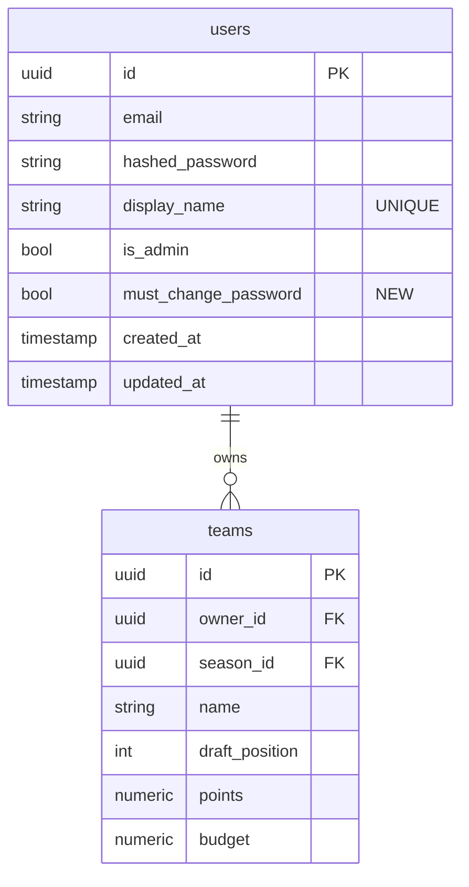

# feat: Password Reset, Profile Updates, and Unified League Home

## Overview

Three user-facing improvements to the IPL fantasy platform:

1. **Password Reset** — "Forgot password?" on the login page generates a one-time temp password shown on screen. Admin can also reset any user's password. Forced change on next login.
2. **Profile Updates** — Users can update their account display name and password via a new `/account` page accessible from the nav bar.
3. **Unified League Home** — Merge the duplicated `page-league` and `page-season` into a single `/league/:leagueId` page with Home, Draft Room, and Settings (admin-only) tabs. Post-draft redirect goes to league home.

_(See brainstorm: docs/brainstorms/2026-03-25-ui-improvements-brainstorm.md)_

---

## Problem Statement

- Users who forget their password have no recovery path and must contact the developer directly.
- Display names are set at registration and immovable; team names can be renamed in `page-season` but the feature is not discoverable.
- `/league/:leagueId` and `/season/:seasonId` both exist as separate routes with nearly identical tab chrome, creating a confusing dual-navigation model. Admin settings live on `page-season` but are unreachable from `page-league` without a redirect button.

---

## Proposed Solution

### Feature 1: Password Reset

**Backend** — One new DB column, two new endpoints, extended user schema.

**Frontend** — Add `'forgot'` mode to the login page; new `/account` page for authenticated password change; extend `guardRoute()` to intercept users with `must_change_password = true`.

**Flow — self-service reset:**
1. User clicks "Forgot password?" → enters email
2. Backend generates an 8-char uppercase alphanumeric temp password via `secrets.token_urlsafe`
3. Backend hashes and stores it, sets `must_change_password = True`
4. Temp password displayed once on screen in a copy-able box
5. User logs in with temp password → `guardRoute()` detects flag → redirects to `/account?force=true`
6. User sets new password → `must_change_password` cleared → redirected to `/my-leagues`

**Flow — admin-initiated reset:**
1. Admin visits Settings tab on `/league/:leagueId`
2. Admin sees a "Users" section listing all league members
3. Admin clicks "Reset password" → temp password shown in a modal

**Security decisions (from SpecFlow analysis):**
- Existing JWT tokens are **not** invalidated on password reset (stateless HS256, no revocation; acceptable for invite-only app with 10-20 users)
- `must_change_password` is returned in `GET /api/auth/me` and checked by `guardRoute()` on every guarded route load, not just at login — covers users with still-valid tokens
- Reset endpoint returns same generic success message whether or not the email exists (prevent enumeration)

### Feature 2: Profile Updates

**Backend** — `PATCH /api/auth/me` for display name only. `POST /api/auth/change-password` for password (separate endpoints to avoid accidental field clobbering).

**Frontend** — New `page-account.ts` at `/account`. Nav bar dropdown gains "Account" link. After successful display name update, re-fetch `/me` to refresh sessionStorage cache and dispatch a `user-updated` custom event that `nav-bar.ts` listens for.

**Display name uniqueness:** Enforce uniqueness at DB level (standings and draft boards show display names; duplicates are confusing in a 10-person league).

**Team rename** carries forward to the unified league Home tab (already implemented in `page-season.ts`). The `/account` page does **not** duplicate team rename — keep that surface on the league page where season context is available.

### Feature 3: Unified League Home

**Canonical URL:** `/league/:leagueId` (see brainstorm decision).

**Strategy:** Expand `page-league.ts` to absorb all content from `page-season.ts`. Convert `page-season.ts` to a minimal redirect shell.

**Tab structure:**

| Tab | Audience | Content |
|-----|----------|---------|
| **Home** | All | Status `setup`/`drafting`: team grid sorted by draft position + inline team rename for own team. Status `active`/`completed`/`archived`: standings leaderboard with expandable rosters and points. |
| **Draft Room** | All | Invite code (setup only), player pool count, Enter Draft Room button. Admin: Start Draft / End Draft controls. |
| **Settings** | Admin only | Season rename, delete season, draft rules (rounds, timer, role limits, timeout), draft order, player import/clear. + Users section with password reset. |

**Routing changes:**
- `/season/:seasonId` → `page-season.ts` becomes a redirect shell: fetches `season.league_id`, navigates to `/league/${leagueId}`
- `/season/:seasonId/players` → redirect to `/league/${leagueId}?tab=draft` (players are now accessible from Draft Room tab)
- `page-snake-draft.ts` post-draft redirect → `/league/${leagueId}` (fetched from draft state's `season.league_id`)
- "Go to League →" banner on draft completion → `/league/${leagueId}`

**Multi-season:** Always show the most recently created season (consistent with current `page-league.ts` behavior). Season selector is out of scope.

**Home tab state during `drafting`:** Show team grid (not leaderboard), consistent with "pre-result" state.

---

## Technical Approach

### Architecture

```
Backend changes:
  models/user.py           — add must_change_password column
  schemas/auth.py          — add UserUpdate, ForgotPasswordRequest, ForgotPasswordResponse,
                             ChangePasswordRequest; extend UserResponse with must_change_password
  services/auth_service.py — add generate_temp_password(), change_password(), update_user_profile()
  routers/auth.py          — add POST /api/auth/forgot-password, POST /api/auth/change-password,
                             PATCH /api/auth/me
  migrations/              — new idempotent migration for must_change_password column + display_name unique

Frontend changes:
  services/auth.ts         — extend UserInfo with must_change_password; export refreshUser();
                             update guardRoute() to check flag
  services/api.ts          — add forgotPassword(), changePassword(), updateProfile()
  components/nav-bar.ts    — add "Account" link in user dropdown; listen for user-updated event
  pages/page-login.ts      — add 'forgot' mode (third tab/link below login form)
  pages/page-account.ts    — NEW: display name + change password
  pages/page-league.ts     — EXPAND: absorb all page-season.ts content; 3-tab layout
  pages/page-season.ts     — REPLACE: minimal redirect shell
  pages/page-snake-draft.ts — update post-draft redirect to /league/${leagueId}
  app-shell.ts             — add /account route; update /season/:seasonId to redirect component
```

### Database Changes

```sql
-- New column on users table
ALTER TABLE users ADD COLUMN IF NOT EXISTS must_change_password BOOLEAN NOT NULL DEFAULT FALSE;

-- Unique constraint on display_name
ALTER TABLE users ADD CONSTRAINT users_display_name_unique UNIQUE (display_name);
```

### Data Model ERD



---

## Implementation Phases

### Phase 1: Password Reset (Backend + Frontend)

**Backend tasks:**

- [x] `backend/app/models/user.py` — add `must_change_password: Mapped[bool] = mapped_column(Boolean, nullable=False, server_default='false')`
- [x] `backend/migrations/versions/` — new Alembic migration using idempotent `ALTER TABLE ... ADD COLUMN IF NOT EXISTS` pattern (match `b3c5d7e9f1a2` style):
  ```python
  # YYYYMMDD_add_must_change_password_to_users.py
  conn = op.get_bind()
  conn.execute(sa.text(
      "ALTER TABLE users ADD COLUMN IF NOT EXISTS must_change_password BOOLEAN NOT NULL DEFAULT FALSE"
  ))
  ```
- [x] `backend/app/schemas/auth.py` — extend `UserResponse` with `must_change_password: bool`; add `ForgotPasswordRequest(email: EmailStr)`, `ForgotPasswordResponse(temp_password: str)`, `ChangePasswordRequest(current_password: str | None, new_password: str)`
- [x] `backend/app/services/auth_service.py` — add:
  - `generate_temp_password() -> str` — `secrets.token_urlsafe(6).upper()[:8]` (8-char uppercase)
  - `forgot_password(db, email) -> str | None` — generates temp, hashes it, saves to user, sets flag; returns temp password or `None` if email not found (caller always returns success)
  - `change_password(db, user, current_password, new_password)` — validates current_password (skip if `must_change_password == True`), hashes new password, clears flag; raises `HTTPException(400)` on bad current password
- [x] `backend/app/routers/auth.py` — add:
  - `POST /api/auth/forgot-password` — unauthenticated; calls `forgot_password()`; always returns `{ "message": "If this email exists, a temp password has been generated" }` to prevent enumeration; but **also** returns `temp_password` in response body (screen display, invite-only app)
  - `POST /api/auth/change-password` — requires `get_current_user`; calls `change_password()`

**Frontend tasks:**

- [x] `frontend/src/services/auth.ts` — extend `UserInfo` interface with `must_change_password: boolean`; update `guardRoute()` to check `user.must_change_password && window.location.pathname !== '/account'` → redirect to `/account?force=true`; export `refreshUser()` that calls `getMe()` and updates cache
- [x] `frontend/src/services/api.ts` — add `forgotPassword(email: string)`, `changePassword(currentPassword: string | null, newPassword: string)`
- [x] `frontend/src/pages/page-login.ts` — add `'forgot'` as a third state (link below the login form, not a tab): clicking it switches the form to a single email input + "Get temp password" button → on success, shows a green box with the temp password and a "Copy" button, then auto-shows the login form after 5 seconds
- [x] `frontend/src/pages/page-account.ts` — **new file**: Lit element; two sections:
  - **Update Display Name**: form with display name input + save button; on success call `refreshUser()` + dispatch `new CustomEvent('user-updated', { bubbles: true, composed: true })`
  - **Change Password**: form with current password + new password + confirm new password; if URL has `?force=true`, hide current password field and show "You are using a temporary password" banner; on success, if `?force=true` redirect to `/my-leagues`
- [x] `frontend/src/app-shell.ts` — add `/account` route
- [x] `frontend/src/components/nav-bar.ts` — add "Account" `<button>` before "Logout" in the user dropdown; navigate to `/account`; add `connectedCallback` listener for `user-updated` event to call `_loadUser()` and re-render

### Phase 2: Unified League Home

**Frontend tasks (largest phase):**

- [x] `frontend/src/pages/page-league.ts` — **expand to full unified page**:
  - Add `activeTab: 'home' | 'draft' | 'settings'` state (default `'home'`)
  - Load both league + season (via `api.getLeague()` which already returns season); additionally load `teams` and `players` as needed
  - **Tab chrome**: update tab CSS to use `var(--accent)` and `var(--border-color)` instead of hardcoded hex
  - **Home tab** render logic:
    - If `season.status === 'setup' || 'drafting'`: render team grid with draft-position order + inline rename widget for own team (port `renderHome()`, `startTeamRename()`, `cancelTeamRename()`, `saveTeamRename()` from `page-season.ts`)
    - Else (`active`, `completed`, `archived`): render standings leaderboard (already in `page-league.ts` `renderLeaderboard()`)
  - **Draft Room tab**: port `renderDraftRoom()` from `page-season.ts` (player count, start draft, enter draft room, player pool link); keep invite code visibility gated to `status === 'setup'`
  - **Settings tab** (admin only): port all of `renderSettings()` from `page-season.ts` (season rename, delete, draft rules, draft order, player import/clear); **add "Users" sub-section** listing league members (`api.getLeagueMembers(leagueId)` if endpoint exists, else use teams to derive member list) with "Reset Password" button per user that calls `POST /api/auth/admin-reset-password` → shows temp password in a modal
- [x] `backend/app/routers/auth.py` — add `POST /api/auth/admin-reset-password` (requires `get_current_admin`); takes `{ user_id: UUID }`; calls `forgot_password()` by user ID; returns `{ temp_password: str }`
- [x] `frontend/src/pages/page-season.ts` — **replace with redirect shell**:
  ```typescript
  async onBeforeEnter(location) {
    const season = await api.getSeasonById(location.params.seasonId);
    window.location.replace(`/league/${season.league_id}`);
  }
  ```
  Keep the season players sub-route (`/season/:seasonId/players`) as a redirect too.
- [x] `frontend/src/pages/page-snake-draft.ts` — update post-draft redirect:
  - The draft state response includes `season_id`; fetch `season.league_id` via `api.getSeasonById(this.seasonId)` (or add `league_id` to draft state WebSocket payload)
  - Change `window.location.href = /season/${this.seasonId}` → `window.location.href = /league/${leagueId}`
  - Update "Go to League →" banner link accordingly
- [x] `frontend/src/app-shell.ts` — update `/season/:seasonId` entry to point to the new redirect shell; ensure `/season/:seasonId/players` also redirects

### Phase 3: Display Name Uniqueness Migration

- [x] `backend/migrations/versions/` — new migration adding unique constraint on `users.display_name`:
  ```python
  conn.execute(sa.text(
      "ALTER TABLE users ADD CONSTRAINT IF NOT EXISTS users_display_name_unique UNIQUE (display_name)"
  ))
  ```
  Note: run `SELECT display_name, COUNT(*) FROM users GROUP BY display_name HAVING COUNT(*) > 1` before migrating to check for pre-existing duplicates.
- [x] `backend/app/routers/auth.py` PATCH handler — catch `IntegrityError` on display name conflict and return `HTTP 409 Conflict`
- [x] `frontend/src/pages/page-account.ts` — handle 409 response with inline error message "This display name is already taken"

---

## System-Wide Impact

### Interaction Graph

- `POST /api/auth/forgot-password` → writes `hashed_password` + `must_change_password=True` to `users` table → no other side effects
- `guardRoute()` (frontend) → calls `getMe()` → reads `must_change_password` → if true, redirects to `/account?force=true` before the original component mounts
- `POST /api/auth/change-password` → writes `hashed_password` + `must_change_password=False` → no cascade
- `PATCH /api/auth/me` → writes `display_name` → `user-updated` event dispatched → `nav-bar.ts` re-fetches and re-renders
- `/season/:seasonId` redirect shell → triggers `api.getSeasonById()` on every legacy URL visit (one extra DB read per such visit)

### Error & Failure Propagation

- `forgot_password()` for unknown email: service returns `None`, router returns `HTTP 200` with generic message (no 404 to prevent enumeration). Frontend always shows the temp-password display box (or a success message if server returns no temp password).
- `change_password()` with wrong current password: `HTTP 400 { detail: "Current password is incorrect" }` → frontend shows inline error, does not clear the form.
- `PATCH /api/auth/me` with duplicate display name: `IntegrityError` → `HTTP 409` → frontend shows "Display name already taken".
- Season redirect shell failing: `api.getSeasonById()` returns 404 → redirect to `/` with a toast error.

### State Lifecycle Risks

- `must_change_password` flag and the user's JWT token are independent. A user with a valid 24hr token who has `must_change_password = True` will be intercepted by `guardRoute()` on their next page navigation — but not if they already have the page open. This is acceptable for an invite-only app.
- `page-league.ts` absorbing `page-season.ts` content means all season-mutation actions (delete season, start draft) are now on the league page. The existing backend `get_current_admin` guards remain unchanged — the risk is only at the UI level, and `isAdmin()` checks are already in place.
- Display name uniqueness migration: if two users already share a display name, the `ADD CONSTRAINT` will fail. The migration must include a pre-check or a manual dedup step.

### API Surface Parity

- Admin password reset needs both a frontend button (Settings tab) and a backend endpoint (`POST /api/auth/admin-reset-password`). The self-service `POST /api/auth/forgot-password` is similar but unauthenticated and identified by email rather than user_id.
- `PATCH /api/auth/me` and `POST /api/auth/change-password` are two separate endpoints (not combined) to avoid accidental field clobbering on partial updates.

### Integration Test Scenarios

1. **Forgot password → login → forced change → access league**: Full round-trip verifying `must_change_password` flag lifecycle.
2. **Admin resets password for another user → user with valid token navigates → intercepted by guardRoute**: Validates that the flag check happens on route guard, not just at login.
3. **Display name duplicate rejection**: Two users attempt to set the same display name; second one gets 409.
4. **Legacy `/season/:seasonId` URL**: Navigate to old URL, verify redirect to `/league/:leagueId`, verify correct league loaded.
5. **Post-draft redirect**: Draft completes via WebSocket `is_complete: true`; verify `window.location.href` points to `/league/:leagueId` with the correct ID.

---

## Acceptance Criteria

### Feature 1: Password Reset

- [ ] "Forgot password?" link visible below the login form on `page-login.ts`
- [ ] Clicking it reveals an email input form; submitting shows the generated temp password in a copy-able box
- [ ] Temp password is 8 characters, uppercase alphanumeric
- [ ] Backend always returns HTTP 200 regardless of whether email exists
- [ ] `must_change_password = True` is set in DB and reflected in `GET /api/auth/me` response
- [ ] `guardRoute()` intercepts any authenticated user with `must_change_password = True` and redirects to `/account?force=true`
- [ ] On `/account?force=true`: current password field is hidden; "temporary password" banner is shown
- [ ] After successful forced password change: `must_change_password` cleared; user redirected to `/my-leagues`
- [ ] Admin can reset any user's password from the Settings tab "Users" section; temp password shown in modal
- [ ] `POST /api/auth/admin-reset-password` requires `get_current_admin`; non-admins get 403

### Feature 2: Profile Updates

- [ ] Nav bar user dropdown has "Account" link above "Logout"
- [ ] `/account` page renders for any authenticated user
- [ ] Display name can be updated; success updates sessionStorage cache and re-renders nav bar without a page reload
- [ ] Duplicate display name returns a user-visible error "This display name is already taken"
- [ ] Password can be changed from the Account page with current password validation
- [ ] `must_change_password` flag is cleared after any successful password change

### Feature 3: Unified League Home

- [ ] `/league/:leagueId` shows three tabs: Home, Draft Room, Settings (admin-only)
- [ ] Home tab: shows team grid when `status in (setup, drafting)`; shows standings leaderboard when `status in (active, completed, archived)`
- [ ] Inline team rename works on Home tab for own team (and all teams for admin)
- [ ] Draft Room tab shows invite code only when `status === 'setup'`; admin sees Start Draft button when `status === 'setup'`
- [ ] Settings tab only visible to admin; contains all previous `page-season.ts` settings functionality
- [ ] Settings tab includes "Users" section with per-user password reset
- [ ] `/season/:seasonId` redirects to `/league/${season.league_id}` — no visible content rendered
- [ ] Post-draft redirect from `page-snake-draft.ts` targets `/league/:leagueId`
- [ ] Tab CSS uses design tokens (`var(--accent)`, `var(--border-color)`) not hardcoded hex

---

## Dependencies & Risks

| Risk | Likelihood | Mitigation |
|------|-----------|-----------|
| `page-league.ts` expansion is a large refactor (~400 lines added) | Medium | Port methods from `page-season.ts` verbatim first; then clean up CSS |
| `page-season.ts` redirect shell breaks `/season/:seasonId/players` and `/season/:seasonId/draft/snake` sub-routes if not updated in `app-shell.ts` | High | Update all three `/season` routes simultaneously |
| Display name unique constraint fails on Railway if existing duplicates exist | Low (10-20 users, likely unique) | Add pre-check query to migration; fail-fast with clear error |
| `must_change_password` not checked for users with valid pre-existing tokens | Low (invite-only) | `guardRoute()` checks on every route entry, not just login |
| `league_id` not available in draft WebSocket state for redirect | Medium | `page-snake-draft.ts` already has `this.seasonId`; add one `getSeasonById` API call |

---

## Sources & References

### Origin

- **Brainstorm document:** [docs/brainstorms/2026-03-25-ui-improvements-brainstorm.md](docs/brainstorms/2026-03-25-ui-improvements-brainstorm.md)
  - Key decisions carried forward: (1) temp password shown on screen, no email needed; (2) `/league/:leagueId` is canonical URL; (3) separate endpoints for display name and password change

### Internal References

- User model: `backend/app/models/user.py`
- Auth service: `backend/app/services/auth_service.py`
- Auth router: `backend/app/routers/auth.py`
- Auth schemas: `backend/app/schemas/auth.py`
- Most recent migration (idempotent pattern): `backend/migrations/versions/b3c5d7e9f1a2_add_points_to_players.py`
- Login page: `frontend/src/pages/page-login.ts`
- League page (to expand): `frontend/src/pages/page-league.ts`
- Season page (to convert to redirect): `frontend/src/pages/page-season.ts`
- Draft post-completion redirect: `frontend/src/pages/page-snake-draft.ts` (line 307)
- Nav bar user dropdown: `frontend/src/components/nav-bar.ts` (lines 277–287)
- Auth frontend service: `frontend/src/services/auth.ts`
- API frontend service: `frontend/src/services/api.ts`
- Shared styles + design tokens: `frontend/src/styles/shared-styles.ts`
- Route definitions: `frontend/src/app-shell.ts` (lines 41–50)
- Railway migration fix (always derive sync URL from async): `docs/fixes/railway-migration-not-running.md`
